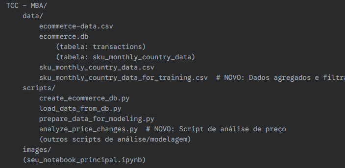

# Projeto TCC MBA em Ciência de Dados: Precificação Dinâmica de SKUs

Este documento detalha as etapas iniciais de um projeto de TCC de MBA em Ciência de Dados focado na implementação de um sistema de precificação dinâmica de SKUs, inspirado em estratégias de grandes players do varejo. O projeto combina previsão de demanda e otimização de preço, buscando maximizar receita ou margem de lucro.

## Visão Geral do Projeto

O objetivo principal é construir um sistema que, para cada SKU, possa:
1.  Simular uma distribuição de preços viáveis.
2.  Prever a distribuição da demanda para cada cenário de preço, com intervalos de confiança.
3.  Calcular a receita (ou margem) esperada.
4.  Encontrar o preço ótimo que maximiza a receita/margem, respeitando as realidades do negócio.

Um ponto chave da abordagem é a capacidade do algoritmo de Machine Learning de inferir o impacto de fatores externos (como o preço do concorrente) a partir dos dados históricos de vendas internas, sem a necessidade de coletar esses dados explicitamente.

## Estrutura do Projeto

A estrutura de pastas do projeto é a seguinte:

## Etapas Concluídas Até Agora

### 1. Configuração e Carregamento de Dados Iniciais

* **Fonte de Dados:** Utilizamos o dataset `ecommerce-data` do Kaggle, que contém informações transacionais de um e-commerce.
* **Armazenamento Local:** Decidimos armazenar os dados em um banco de dados SQLite (`ecommerce.db`) para facilitar o consumo via scripts Python e notebooks.
* **Seleção de Colunas:** Filtramos o dataset para usar apenas as colunas relevantes: `InvoiceNo`, `StockCode`, `Description`, `Quantity`, `InvoiceDate`, `UnitPrice`, `CustomerID`, `Country`.
* **Scripts Criados:**
    * `scripts/create_ecommerce_db.py`: Este script carrega o `ecommerce-data.csv`, realiza uma limpeza inicial (tratamento de nulos críticos, filtragem de quantidades/preços não positivos), seleciona as colunas especificadas e as salva em uma tabela (`transactions`) no `ecommerce.db`.
    * `scripts/load_data_from_db.py`: Este script é uma função auxiliar para carregar os dados da tabela `transactions` do `ecommerce.db` para um DataFrame pandas, garantindo que `InvoiceDate` seja um tipo `datetime`.
* **Uso de `pathlib`:** Todos os caminhos de arquivos foram definidos utilizando a biblioteca `pathlib.Path`, que oferece uma manipulação de caminhos mais robusta e orientada a objetos.

### 2. Preparação e Agregação de Dados para Modelagem

* **Objetivo:** Transformar os dados transacionais em séries temporais agregadas mensais, por SKU e País, para uso na previsão de demanda.
* **Script Criado:** `scripts/prepare_data_for_modeling.py`
* **Funcionalidades:**
    * Carrega os dados brutos do `ecommerce.db` usando `load_data_from_db`.
    * Extrai o `InvoiceYearMonth` da `InvoiceDate` (sem considerar a hora).
    * Calcula a `TotalRevenuePerItem` (`Quantity` \* `UnitPrice`) como um passo intermediário.
    * **Agrupa os dados por `StockCode`, `InvoiceYearMonth` e `Country`**.
    * Calcula a **`total_quantity`** (soma das quantidades vendidas) e o **`avg_price_monthly`** (preço médio ponderado pela receita total dividida pela quantidade total) para cada grupo.
    * Remove a coluna `total_revenue` do DataFrame final agregado.
    * Converte `InvoiceYearMonth` para um formato de data amigável (`YYYY-MM`).
    * Salva o DataFrame agregado em um CSV (`sku_monthly_country_data.csv`) e também em uma nova tabela no `ecommerce.db` (`sku_monthly_country_data`).

### 3. Análise Exploratória e Limpeza de Outliers

* **Análise de Alterações de Preço:**
    * Calculamos a `price_change` (diferença de preço mês a mês) e a `price_change_abs` (magnitude da alteração) para cada série SKU-País.
    * **Categorizamos os SKUs em três dicionários (por SKU e países associados):**
        * `skus_with_price_changes_by_country`: SKUs que tiveram pelo menos uma alteração de preço.
        * `skus_without_price_changes_by_country`: SKUs que não tiveram alteração de preço (mas com dados suficientes).
        * `skus_with_insufficient_data_by_country`: SKUs com um ou menos pontos de dados mensais.
    * **Importância para ML:** Para o modelo de precificação dinâmica, focaremos no treinamento com `skus_with_price_changes_by_country`, pois são eles que fornecem a informação de elasticidade-preço.
* **Visualização de Valores Faltantes:**
    * Geramos um gráfico de barras (`missing_values_df_for_training.png`) da contagem de valores faltantes no `df_for_training`.
    * **Interpretação:** Confirmamos que apenas a coluna `price_change` continha `NaN`s (no início de cada série temporal, onde não há mês anterior para calcular a diferença), o que é esperado.
    * **Tratamento:** Preenchemos esses `NaN`s em `price_change` com `0` (`df_for_training = df_for_training.fillna(0)`).
* **Análise e Tratamento de Outliers na Demanda (`total_quantity`):**
    * Geramos um histograma da `total_quantity` original (com escala `symlog` no eixo Y) que mostrou uma distribuição altamente enviesada e com outliers extremos.
    * **Decisão:** Optamos por aplicar uma **transformação logarítmica (`np.log1p`)** na coluna `total_quantity` para `log_total_quantity`.
        * **Razão para `+1`:** Para lidar com valores de `0` na `total_quantity`, já que `log(0)` é indefinido. `np.log1p(0)` resulta em `0`.
        * **Benefícios:** A transformação normaliza a distribuição, tornando-a mais simétrica e reduzindo o impacto dos outliers, o que é crucial para a estabilidade e precisão do modelo de Machine Learning.
    * Geramos um novo histograma da `log_total_quantity` que confirmou a distribuição mais simétrica e adequada para modelagem.
* **Visualizações Otimizadas:**
    * Para evitar gráficos "poluídos", passamos a gerar visualizações agregadas (histogramas de distribuição de alterações de preço, boxplots por país) utilizando **escalas `symlog` e `log`** para melhor representação de dados com grandes variações e concentração em zero.
    * Todos os gráficos gerados são salvos automaticamente na pasta `images/`.

## Próximos Passos

Com os dados agora limpos, agregados e transformados para serem mais adequados aos modelos, o próximo grande passo será a **implementação do modelo de previsão de demanda**. Isso incluirá:

* Definir a estratégia para densificar o `df_for_training` (preencher meses sem vendas com 0s para quantidade e LOCF para preço).
* Engenharia de features adicionais (sazonalidade, feriados, etc.).
* Seleção de um modelo de previsão de demanda (ex: Prophet, SARIMA, XGBoost).
* Divisão dos dados em treino/teste e avaliação do modelo.
